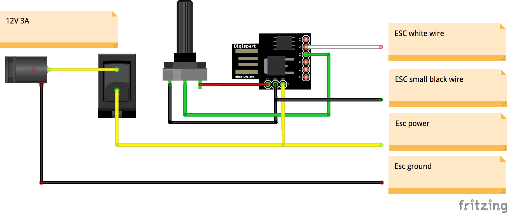

# F.Lab's DIYbio Centrifuge

This a remix of [F.Lab's DIYbio Centrifuge](https://www.thingiverse.com/thing:1175393) with the following changes:

  * Uses a [Digispark](http://digistump.com/products/1) (or clone) ATTiny85 board instead of an Arduino
  * The STL files were repaired as they were made from Sketchup and were not usable with Slic3r

## Usage

First, install [PlatformIO](http://platformio.org) on your platform of choice.

Run in the root directory of this project:

    pio run

And plug in the Digispark when it tells you to. Upload takes a couple of seconds.

Make sure no components are connected while uploading to the Digispark. Do the upload before soldering.

## Schematic

## Attribution

The included STL files and the whole project were originally created by [F.Lab](https://www.facebook.com/FLabDIYbioThailand/).
