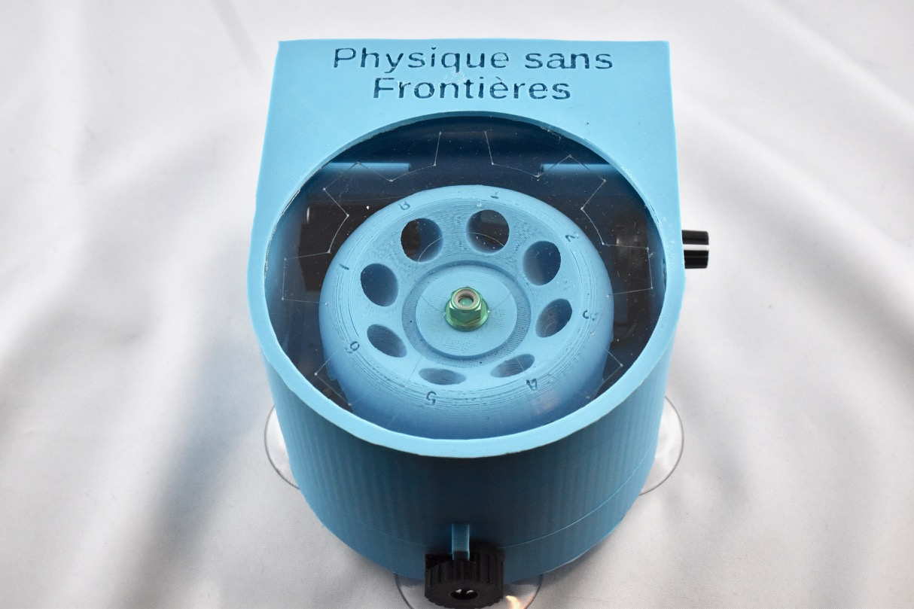
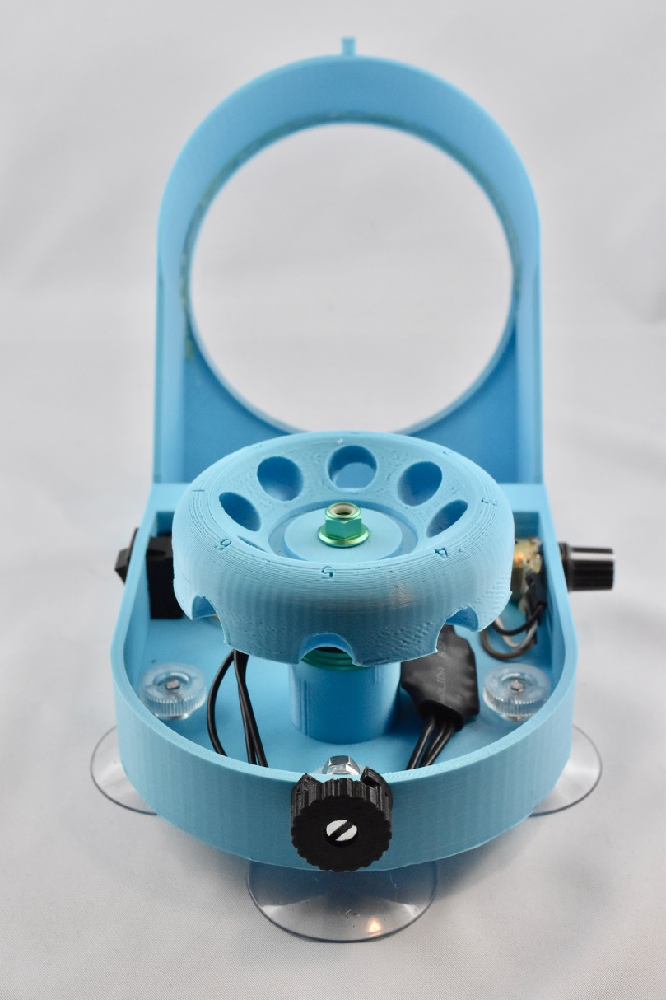
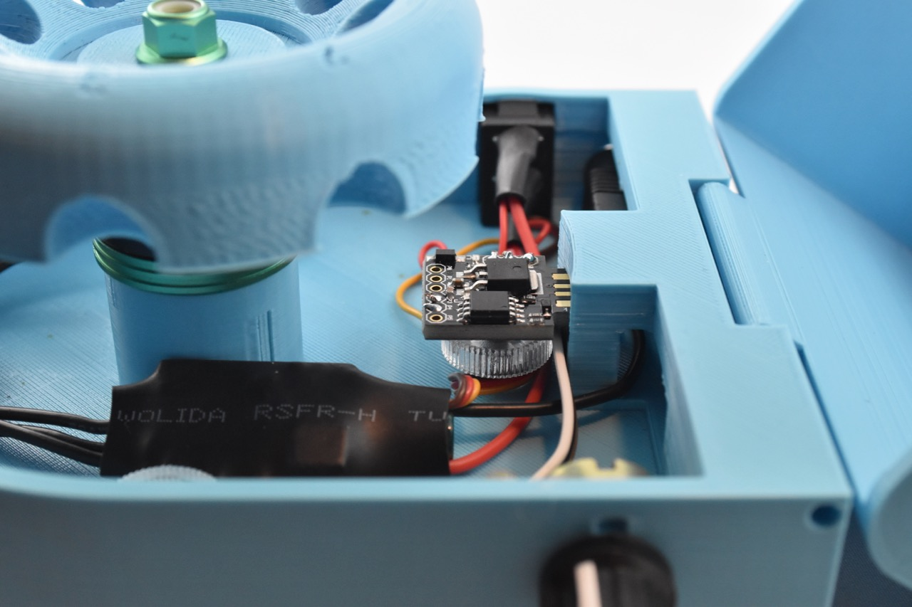

# Physique sans Frontières Centrifuge

Designed for [PHYSIQUE SANS FRONTIÈRE](https://www.sfpnet.fr/commission/physique-sans-frontiere), a division of the [French Society of Physics](https://www.sfpnet.fr).

This 3D printed centrifuge uses a drone motor to spin 8 1.5ml Eppendorf tubes. It is also designed to be very cheap and accomodating of different parts for countries with limited access to such parts.

## Bill of Materials

| Name | Quantity | Price | Link |
|------|----------|-------|------|
| 12V power supply with barrel jack with 5x5/2.1mm barrel jack connector, power depends on the motor you use | 1 | depends | |
| female 5.5/2.1mm barrel jack connector with screw terminals | 1 | ? | |
| 12V SPST 10*15mm switch | 1 | ? | |
| B10k 10k Ohm Adjustment Single Linear Rotary Potentiometer | 1 | ? | |
| Digispark ATTINY85 | 1 | ? | |
| MT1806 2400KV CW/CCW Motor 1806 Mini Brushless Motor | 1 | ? | |
| BLHeli OPTO mini-16A ESC | 1 | ? | |
| 4mm screw | 1 | ? | |
| 4mm Suction cups | 4 | ? | |
| 3mm rod | 1 | ? | |
| acrylic window (optional) | 0-1 | ? | |

## Schematic

## Instruction

### Hardware

#### Printing

There is a couple of choices before hand:

If you want to have a window on the lid, you need to print [lid_window.stl](stl/lid_window.stl) and also use a laser cutter to cut and engrave [window.dxf](dxf/window.dxf) using acrylic.

Otherwise, just print [lid_no_window.stl](lid_no_window.stl).

For the motor, depending on the type you chose, print either [base_universal.stl](stl/base_universal.stl) for the beefier motors or [base_small_motor.stl](stl/base_small_motor.stl) for smaller motors that uses m3 holes spaced 16mm and 19mm.

Then print the rotor and the latch.

No parts needs supports except for the latch.

#### Preparing

The base needs some preparation: there is a couple of walls that needs to be removed on the inside where the power jack is situated. If there is some plastic that needs cleaning on the ceiling on the inside, remove it.

#### Software 

First, install [PlatformIO](http://platformio.org) on your platform of choice.

Run in the root directory of this project:

    pio run

And plug in the Digispark when it tells you to. Upload takes a couple of seconds.

Make sure no components are connected while uploading to the Digispark. Do the upload before soldering.

#### Soldering

You can solder the wires according for the schematics, except for the following:

 * The wires going to the switch, as it needs to be installed on the base first.
 * The wires connecting the ESC and the motor.

Drones motors comes in either CW (Clockwise) or CCW (Counter-clockwise) and needs to spin in their intended rotation direction otherwise the nut will unscrew itself and the rotor will fly in the direction of the nearest face.

To prevent that, do a test run using temporary connectors and invert the cables if the direction is not right. Only then solder them.

**Note** if the ESC has a wire for 5V, do not use it, only connect the Ground and Signal wires.

#### Assembly

Start by a test fit of the barrel jack connector, it's a very tight fit on purpose and depending on the amount of rubber molding surrounding it, you might need to remove some of it.

 * Install the motor. It needs to be really secure. If using a big motor, use a metal bracket between the base and the motor.
 * Connect the barrel jack wires. One of them will do behind the center pilar.
 * Install the switch and connect/solder the wires to it.
 * Install the rotary potentiometer and secure it with the included nut and washer. Put on the included knob if any, or print one.
 * Install the 4 suction cups with their nuts.
 * Slide the digispark in the slot in the center pillar.
 * Screw in the latch using a 4mm bolt and a self locking nut on the front of the base.
 * Slide the rotor on the motor shaft and secure it using the nut included with the motor.
 * Glue in the window on inside of the lid using hot glue if applicable.
 * Assemble the base and the lid using a 3mm rod.

## Usage

 * Install the Eppendorf tubes in a balanced manner on the rotor.
 * Close the lid using the latch.
 * Plug in the power.
 * Switch on the centrifuge.
 * A short calibration procedure will start, lasting 10 seconds.
 * You can now select the speed using the knob.

## Attribution

The rotor comes from Biohack Academy's OpenFuge
